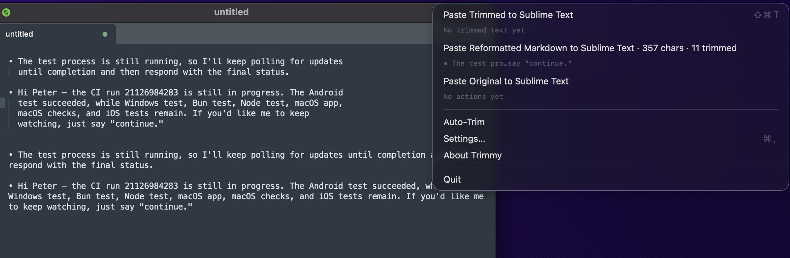

# Trimmy ✂️ - “Paste once, run once” — flattens multi-line shell snippets so they execute

> "Paste once, run once." — Trimmy flattens those multi-line shell snippets you copy so they actually paste and run.

**Install via Homebrew:** `brew install --cask steipete/tap/trimmy`




## What it does
- Lives in your macOS menu bar (macOS 15+). No Dock icon.
- Watches the clipboard and, when it looks like a shell command, removes newlines (respects `\` continuations) and rewrites the clipboard automatically.
- Strips leading shell prompts (`#`/`$`) when the line looks like a command, while leaving Markdown headings untouched.
- Aggressiveness is configurable separately for regular apps and terminals (defaults: Low for general apps, Normal for terminals), with a “None” option to disable auto-trim in regular apps.
- Detects terminal apps (Terminal/iTerm/Ghostty/Warp/WezTerm/Alacritty/Hyper/kitty) and applies the terminal-specific aggressiveness when context-aware trimming is enabled.
- Optional "Keep blank lines" so scripts with intentional spacing stay readable.
- Optional "Remove box drawing chars (│┃)" to strip prompt-style gutters (any count, leading or trailing) and collapse the leftover whitespace.
- "Paste Trimmed" button + hotkey trims on-the-fly and pastes without permanently altering the clipboard (uses High aggressiveness); shows the target app (e.g., “Paste Trimmed to Ghostty”) and strikes out removed chars in the preview.
- "Paste Original" button + hotkey pastes the untouched copy even after auto-trim.
- Optional “Paste Reformatted Markdown” menu action reflows wrapped Markdown paragraphs/bullets/headings while preserving blank lines and fenced code blocks.
- Optional "Launch at login" toggle (macOS 13+ via SMAppService).
- Auto-update via Sparkle (auto-check + auto-download; menu shows “Update ready, restart now?” once downloaded).
- Uses a marker pasteboard type to avoid reprocessing its own writes; polls with a lightweight timer and a small grace delay to catch promised pasteboard data.
- Safety valve: skips auto-flatten if the copy is more than 10 lines (even on High) to avoid mangling big blobs.

## Aggressiveness levels & examples
General apps:
- **None** — no auto-flattening for non-terminal apps.
- **Low (safer)** — needs strong command cues (pipes, redirects, continuations).  
  Before:  
  ```
  ls -la \
    | grep '^d' \
    > dirs.txt
  ```  
  After: `ls -la | grep '^d' > dirs.txt`
- **Normal** — README/blog-ready: handles typical multi-line commands with flags.  
  Before:  
  ```
  kubectl get pods \
    -n kube-system \
    | jq '.items[].metadata.name'
  ```  
  After: `kubectl get pods -n kube-system | jq '.items[].metadata.name'`
- **High (eager)** — flattens almost anything command-shaped, plus the manual “Paste Trimmed” hotkey always uses this level.  
  Before:  
  ```
  echo "hello"
  print status
  ```  
  After: `echo "hello" print status`
- **Prompt cleanup** — copies that start with `# ` or `$ ` are de-promoted when they look like shell commands, e.g. `# brew install foo` → `brew install foo`; Markdown headings like `# Release Notes` remain untouched.

Terminals:
- Uses its own Low/Normal/High selector (default: Normal) whenever a terminal app is detected and Context-aware trimming is enabled.

## Quick start
Get the precompiled binary from [Releases](https://github.com/steipete/Trimmy/releases) or install via Homebrew:

- Homebrew: `brew install --cask steipete/tap/trimmy` (update via `brew upgrade --cask steipete/tap/trimmy`)


1. Build: `swift build -c release` (Swift 6, macOS 15+).
2. Bundle: `./Scripts/package_app.sh release` → `Trimmy.app`.
3. Launch: open `Trimmy.app` (or add to Login Items). Menu shows Auto-Trim toggle, Aggressiveness submenu, Keep blank lines toggle, Paste Trimmed/Paste Original actions, optional Paste Reformatted Markdown, and a last-action status.

## Headless trimming (CLI)
Use the bundled CLI to trim text without launching the UI:

```
swift run TrimmyCLI --trim /path/to/file --aggressiveness high --json
```

Pipe stdin:

```
pbpaste | swift run TrimmyCLI --trim - --force
```

Options:
- `--force/-f` forces High aggressiveness
- `--aggressiveness {low|normal|high}`
- `--preserve-blank-lines` / `--no-preserve-blank-lines`
- `--remove-box-drawing` / `--keep-box-drawing`
- `--json` emits `{original, trimmed, transformed}`
- Exit codes: 0 success, 1 no input/error, 2 no transformation, 3 JSON encode error

## Lint / Format
- Format: `swiftformat`.
- Lint: `swiftlint lint --fix` or `swiftlint lint`.

## Release checklist
- [ ] Update version strings and CHANGELOG.
- [ ] swiftformat / swiftlint
- [ ] swift test
- [ ] ./Scripts/package_app.sh release
- [ ] ./Scripts/sign-and-notarize.sh
- [ ] Verify: `spctl -a -t exec -vv Trimmy.app`; `stapler validate Trimmy.app`
- [ ] Upload release zip and tag
- [ ] Homebrew: update `../homebrew-tap/Casks/trimmy.rb` with new `version` + `sha256`

## Notes
- Bundle ID: `com.steipete.trimmy` (LSUIElement menu-bar app).
- Polling: ~150ms with leeway; grace delay ~80ms to let promised data arrive.
- Clipboard writes tag themselves with `com.steipete.trimmy` to avoid loops.

## Related
- 🟦🟩 [CodexBar](https://codexbar.app) — Keep Codex token windows visible in your macOS menu bar.
- ✂️ [Trimmy](https://trimmy.app) — “Paste once, run once.” Flatten multi-line shell snippets so they paste and run.
- 🎛️ [Alfred workflow](https://github.com/jimmystridh/alfred-trimmy) — Alfred integration for Trimmy.
- 🧳 [MCPorter](https://mcporter.dev) — TypeScript toolkit + CLI for Model Context Protocol servers.
- 🧿 [Oracle](https://github.com/steipete/oracle) — Prompt bundler/CLI for GPT-5.1/Claude/Gemini with multi-model support.

## License
MIT
