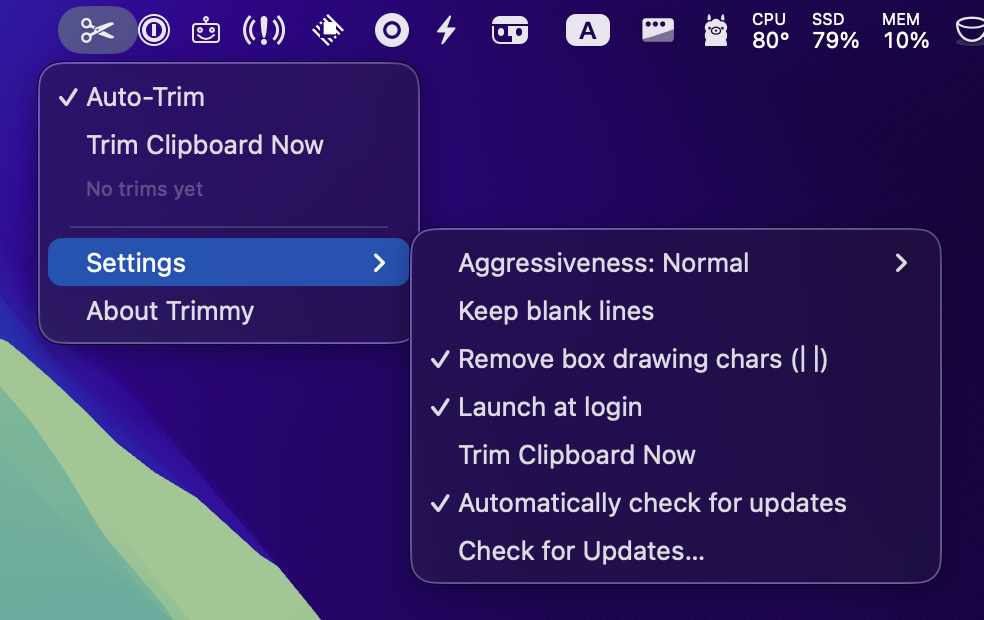

# Trimmy ✂️

> "Paste once, run once." — Trimmy flattens those multi-line shell snippets you copy so they actually paste and run.

## What it does
- Lives in your macOS menu bar (macOS 15+). No Dock icon.
- Watches the clipboard and, when it looks like a shell command, removes newlines (respects `\` continuations) and rewrites the clipboard automatically.
- Aggressiveness levels (Low/Normal/High) to control how eagerly it detects commands:
  - **Low:** only flattens when it’s obviously a command. Example: a long `kubectl ... | jq ...` multi-line snippet.
  - **Normal (default):** balances caution and helpfulness. Example: a `brew update \ && brew upgrade` copy from a blog post.
  - **High:** flattens almost any multi-line text that *could* be a command. Example: a quick two-line `ls` + `cd` copied from chat.
- Optional "Keep blank lines" so scripts with intentional spacing stay readable.
- Optional "Remove box drawing chars (│┃)" to strip prompt-style gutters (any count, leading or trailing) and collapse the leftover whitespace.
- "Paste Trimmed" button + hotkey trims on-the-fly and pastes without permanently altering the clipboard (uses High aggressiveness); shows the target app (e.g., “Paste Trimmed to Ghostty”) and strikes out removed chars in the preview.
- "Paste Original" button + hotkey pastes the untouched copy even after auto-trim.
- Optional "Launch at login" toggle (macOS 13+ via SMAppService).
- Auto-update via Sparkle (Check for Updates… + auto-check toggle; feed from GitHub Releases).
- Uses a marker pasteboard type to avoid reprocessing its own writes; polls with a lightweight timer and a small grace delay to catch promised pasteboard data.
- Safety valve: skips auto-flatten if the copy is more than 10 lines (even on High) to avoid mangling big blobs.

## Quick start
Get the precompiled binary from [Releases](https://github.com/steipete/Trimmy/releases)

1. Build: `swift build -c release` (Swift 6, macOS 15+).
2. Bundle: `./Scripts/package_app.sh release` → `Trimmy.app`.
3. Launch: open `Trimmy.app` (or add to Login Items). Menu shows Auto-Trim toggle, Aggressiveness submenu, Keep blank lines toggle, Paste Trimmed/Paste Original actions, and a last-action status.

## Lint / Format
- Format: `swiftformat`.
- Lint: `swiftlint lint --fix` or `swiftlint lint`.

## Release checklist
- [ ] Update version strings and CHANGELOG.
- [ ] swiftformat / swiftlint
- [ ] swift test
- [ ] ./Scripts/package_app.sh release
- [ ] ./Scripts/sign-and-notarize.sh
- [ ] Verify: `spctl -a -t exec -vv Trimmy.app`; `stapler validate Trimmy.app`
- [ ] Upload release zip and tag

## Notes
- Bundle ID: `com.steipete.trimmy` (LSUIElement menu-bar app).
- Polling: ~150ms with leeway; grace delay ~80ms to let promised data arrive.
- Clipboard writes tag themselves with `com.steipete.trimmy` to avoid loops.

## Related
- CodexBar: keep Codex and Claude usage visible from the menu bar. Download at [codexbar.app](https://codexbar.app).
- Trimmy: get the latest build at [trimmy.app](https://trimmy.app).
- MCPorter: [mcporter.dev](https://mcporter.dev) — TypeScript runtime, CLI, and code-generation toolkit for the Model Context Protocol.

## License
MIT
